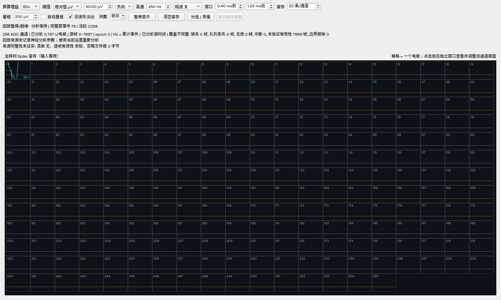
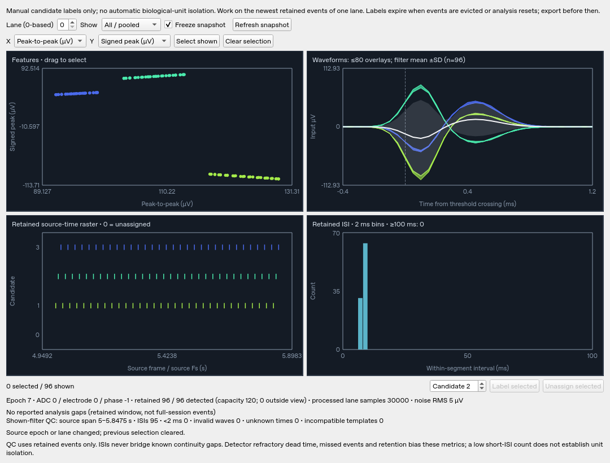

# V7 neural-analysis preview

Version: 7.0.0-preview.1-20261002. Based on commit
`f4780565da036695c2521638d9802997b300553c`.

## What changed

The existing SPI/TCP hardware protocol, raw 256×32-bit frames, live source,
recording, replay and analyzer are preserved. The Spike page now provides a
continuous analysis lifetime tied to the session, independent of which page is
visible. Pausing display does not pause detection. Changing processing settings,
clearing or seeking starts a fresh analysis interval.

Select an electrode to inspect retained waveforms and open the candidate grouping
workspace. It shows physical-unit waveform features, a raster and an ISI view.
Selections can receive **manual candidate labels**, or be returned to unsorted.
This is an exploratory grouping tool. It does not establish that one candidate
is one neuron and does not implement automated template sorting or drift correction.

The selected-lane export saves one atomic JSON file containing waveforms, exact
source-frame coordinates, epoch/continuity segment, source sample rate, phase,
electrode, gain and candidate labels. It also describes actual analyzed exposure,
retention, invalid/unverified data, discarded boundary crossings and pending
post-windows. This is a bounded retained window, **not a complete spike archive**.

## Rendered GUI checks

These are actual Qt offscreen renders from deterministic QA fixtures, not mockups.
The first shows source-time coverage on a replay fixture; the second uses synthetic
candidate-labeled waves to exercise feature, waveform, raster and ISI views.





## Timing and rates

Event time is the causal filtered **threshold crossing**, not an action-potential
peak, injection onset or wall-clock timestamp. Causal filtering introduces delay.
Each waveform's `pre_samples` index locates its crossing. TDM samples are four
source frames apart; sample rate and source-frame rate are not interchangeable.

Rates use complete-window event counts divided by actually analyzed lane source
time. Display pauses, page switches and replay pacing do not add biological
exposure. RMS warm-up, start/end windows and gaps can reduce eligible events;
those rates are descriptive and are not an unbiased firing-rate estimate.

Epochs separate seeks/restarts. Continuity segments separate gaps/invalid samples.
ISI calculations must not bridge either boundary. Pending crossings at EOF remain
explicitly pending; the application does not invent unavailable post-samples.

## Data validity and reproducibility

New session manifests retain raw BIN compatibility and add versioned file-frame
invalid intervals. Synthetic ingress-drop padding and corrupt intra-frame
counters are not neural samples. Replay/seek propagate their masks and preserve
source coordinates. Older loss-flagged sessions without exact validity locations
remain readable but are conservatively excluded from neural detection. Plain raw
BIN remains analyzable, with unverified integrity shown explicitly.

`neural_analysis` in session.json records initial software settings and bounded
requested configuration changes. Change positions are **request positions**, not
atomic per-sample application markers. Replay uses current settings and discloses
this; it does not silently claim exact reproduction of an original mixed-config run.
Exports retain the original recording provenance alongside current analysis settings.

Gain is still a manually selected uniform 60×/180× conversion. It is not verified
against per-channel REC hardware readback. Absolute-voltage claims therefore depend
on the user's correct calibration. TDM detection covers the selected 512 of 1024
physical sites; raw recordings still carry all four phases.

## Test fixtures

The Python source previously applied 80–420 µV directly to a 1.8 V/12-bit ADC,
without front-end gain. Those spikes spanned only one ADC count. With default 60×,
the verified 80/420 µV fixtures span 15/79 counts. The built-in C++ Dummy already
used this gain and remains the real-time local source.

```sh
python -m unittest discover -s tests -p 'test_dummy_spike_server.py' -v
python tools/dummy_spike_tcp_server.py --output-bin fixture.bin --frames 4000 \
  --truth-jsonl fixture.truth.jsonl --seed 20260726
```

The Python generator is deterministic across chunk sizes and independent clients.
Its default listener is loopback. It does not sustain 20 kframes/s on the measured
cloud interpreter; prefer offline fixtures or the managed C++ Dummy for paced QA.
Truth unit labels are synthetic source labels, not sorting outputs.

## Validation and remaining work

The untouched V6.0.4 baseline compiled on Linux with GCC14.2, Qt6.8.2, CMake3.31.6
and OpenSSL3.5.7; all 40 existing CTest tests passed. The integrated preview adds
regressions for timestamped events, TDM/gaps/wraps/queue loss, candidate identities,
validity split/replay/seek, source-time lifecycle and atomic export.

See `v7_validation_report.md` for the final measured suite and standard-dataset
results. Passing software tests does not validate FPGA timing, stimulation,
hardware gain, network throughput, electrode connectivity or biological isolation.

Priorities after this preview:
1. Lossless offline analysis delivery and complete event recording
2. Per-channel calibrated gain/reference and robust artifact/bad-channel handling
3. Reviewed automated sorting backend, multi-channel features and quality metrics
4. LFP/PSD/time-frequency and event-aligned analysis
5. Hardware acceptance tests and longer sustained acquisition/recording benchmarks
